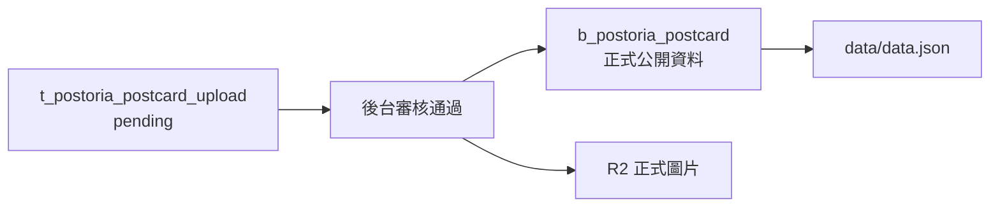

# Postoria 明信片上傳審核功能規格書

更新日期：2026-06-01  
資料表：`t_postoria_postcard_upload`  
適用系統：Postoria / 明信片收藏  
API 主機：https://api.postoria.net  
前端測試站：https://alexhung99.github.io/postoria_test/  
公開資料檔：https://assets.postoria.net/data/data.json

## 1. 功能目標

會員可在前端上傳明信片圖片與基本資料。上傳後資料先進入待審核表：

```text
t_postoria_postcard_upload
```

資料不會立即顯示在公開網站。後台審核通過後，系統才會：

1. 將圖片從暫存區移到正式公開圖片位置。
2. 新增正式明信片資料到：

```text
b_postoria_postcard
```

3. 更新 `t_postoria_postcard_upload.review_status`。
4. 重新產生 `data.json`。
5. 上傳 `data.json` 到 Cloudflare R2。
6. 前端網站透過新的 `data.json` 顯示明信片。

審核不通過時，系統應保留審核紀錄，但不公開、不寫入 `b_postoria_postcard`，並刪除無用圖片檔案。

## 2. 現有前端上傳流程

目前前端登入會員後，可使用「上傳明信片」功能。

前端呼叫 API：

```http
POST https://api.postoria.net/api/members/me/postcard-uploads
Authorization: Bearer {accessToken}
Content-Type: multipart/form-data
```

### 2.1 Request 欄位

| 欄位 | 必填 | 型別 | 說明 |
|---|---:|---|---|
| `image` | 是 | file | JPG / PNG / WebP 圖片 |
| `postcardType` | 是 | string | 取得方式，例如 `打菇`、`花`、`探索` |
| `latitude` | 否 | decimal | 緯度 |
| `longitude` | 否 | decimal | 經度 |
| `title` | 否 | string | 目前前端可不填，後端會用檔名補 |
| `country` | 否 | string | 目前前端不用填，未來審核時可由座標判斷 |
| `city` | 否 | string | 目前前端不用填，未來審核時可由座標判斷 |
| `tags` | 否 | string | 逗號、空白或 hashtag 分隔 |

### 2.2 圖片限制

目前後端限制：

| 項目 | 規格 |
|---|---|
| 最大檔案大小 | 8 MB |
| 支援 MIME | `image/jpeg`、`image/png`、`image/webp` |
| 副檔名 | `.jpg`、`.png`、`.webp` |

### 2.3 上傳成功 Response

```json
{
  "id": "postcard_upload_uid",
  "title": "上傳明信片標題",
  "country": null,
  "city": null,
  "latitude": 25.033,
  "longitude": 121.5654,
  "imagePath": "uploads/postcards/pending/{memberUid}/{uploadUid}.jpg",
  "originalFileName": "photo.jpg",
  "contentType": "image/jpeg",
  "fileSize": 123456,
  "tags": [],
  "postcardType": "花",
  "reviewStatus": "pending",
  "createdAt": "2026-06-01T00:00:00"
}
```

## 3. 圖片檔案放置位置

### 3.1 目前待審核圖片暫存位置

後端設定：

```json
{
  "Postoria": {
    "UploadRootPath": "C:\\GitRepos\\pikimin_gen\\postoria_uploads"
  }
}
```

目前待審核圖片相對路徑格式：

```text
uploads/postcards/pending/{postoria_member_uid:N}/{postcard_upload_uid:N}.{ext}
```

實體檔案路徑：

```text
C:\GitRepos\pikimin_gen\postoria_uploads\uploads\postcards\pending\{postoria_member_uid:N}\{postcard_upload_uid:N}.{ext}
```

資料表欄位：

```text
t_postoria_postcard_upload.image_path
```

儲存相對路徑，例如：

```text
uploads/postcards/pending/aaaaaaaaaaaaaaaaaaaaaaaaaaaaaaaa/bbbbbbbbbbbbbbbbbbbbbbbbbbbbbbbb.jpg
```

### 3.2 審核通過後正式圖片位置

審核通過後，圖片應從本機 pending 暫存區移到 R2 正式公開位置。

建議 R2 key：

```text
images/postoria/uploads/{yyyy}/{MM}/{postcard_uid:N}.{ext}
```

例如：

```text
images/postoria/uploads/2026/06/4f0f4f6e6a2f47d5bb70bb77ce1d79d1.jpg
```

公開 URL：

```text
https://assets.postoria.net/images/postoria/uploads/2026/06/4f0f4f6e6a2f47d5bb70bb77ce1d79d1.jpg
```

正式明信片資料表 `b_postoria_postcard.image_path` 應存 R2 相對路徑：

```text
images/postoria/uploads/2026/06/4f0f4f6e6a2f47d5bb70bb77ce1d79d1.jpg
```

不建議把 `uploads/postcards/pending/...` 直接寫進 `b_postoria_postcard.image_path`，因為：

- pending path 是後端暫存，不是公開資源。
- 檔案未必有 CDN 快取。
- 審核不通過時圖片會被刪除。
- 正式公開圖片應統一由 R2 / `assets.postoria.net` 提供。

## 4. `t_postoria_postcard_upload` Table 設計

用途：會員上傳明信片後，先暫存待審核資料。

### 4.1 欄位註解

| 欄位 | 型別 | 中文註解 |
|---|---|---|
| `postcard_upload_uid` | `uuid` | 明信片上傳 UUID，資料表主鍵。 |
| `company_uid` | `uuid` | 公司 UUID，用於區隔 Postoria 與其他公司資料。 |
| `postoria_member_uid` | `uuid` | 上傳明信片的 Postoria 會員 UUID。 |
| `title` | `varchar(200)` | 上傳明信片標題，未填時可由檔名或審核流程補齊。 |
| `country` | `varchar(80)` | 審核或座標解析後判定的國家或地區。 |
| `city` | `varchar(80)` | 審核或座標解析後判定的城市、州或分類區域。 |
| `latitude` | `numeric(10,7)` | 會員上傳時提供的緯度。 |
| `longitude` | `numeric(10,7)` | 會員上傳時提供的經度。 |
| `image_path` | `varchar(500)` | 上傳圖片暫存相對路徑或儲存路徑。 |
| `original_file_name` | `varchar(255)` | 會員上傳時的原始檔名。 |
| `content_type` | `varchar(100)` | 上傳圖片 MIME 類型。 |
| `file_size` | `bigint` | 上傳圖片檔案大小，單位為 bytes。 |
| `tags` | `text[]` | 上傳資料標籤陣列，審核後可帶入正式明信片。 |
| `postcard_type` | `varchar(50)` | 會員選擇的取得方式或類型，例如打菇、花、探索。 |
| `review_status` | `varchar(20)` | 審核狀態，例如 pending、approved、rejected。 |
| `reviewed_by` | `uuid` | 審核人員 UUID。 |
| `reviewed_at` | `timestamp(0)` | 審核時間。 |
| `review_note` | `text` | 審核備註或退件原因。 |
| `published_postcard_uid` | `uuid` | 審核通過後建立的正式明信片 UUID。 |
| `created_at` | `timestamp(0)` | 資料建立時間，也代表上傳送出時間。 |
| `created_by` | `uuid` | 建立者 UUID，通常為上傳會員。 |
| `updated_at` | `timestamp(0)` | 資料最後更新時間。 |
| `updated_by` | `uuid` | 最後更新者 UUID。 |
| `is_deleted` | `boolean` | 是否已邏輯刪除。 |
| `deleted_at` | `timestamp(0)` | 邏輯刪除時間。 |
| `deleted_by` | `uuid` | 刪除者 UUID。 |
| `remark` | `text` | 備註。 |

### 4.2 審核狀態

建議 `review_status` 使用以下值：

| 狀態 | 說明 |
|---|---|
| `pending` | 待審核，會員剛上傳 |
| `approved` | 審核通過，已建立正式明信片 |
| `rejected` | 審核不通過，不公開 |
| `cancelled` | 會員自行取消或管理員取消 |

目前必要狀態至少應支援：

```text
pending
approved
rejected
```

## 5. 審核通過資料要放在哪一個 Table

審核通過後，正式公開資料必須寫入：

```text
b_postoria_postcard
```

`t_postoria_postcard_upload` 保留作為審核歷史紀錄，不直接作為前台公開明信片來源。

### 5.1 `t_postoria_postcard_upload` 與 `b_postoria_postcard` 關係



審核通過時：

| 來源欄位 | 目標欄位 |
|---|---|
| `t_postoria_postcard_upload.company_uid` | `b_postoria_postcard.company_uid` |
| `title` | `title` |
| `country` | `country` |
| `city` | `city` |
| `latitude` | `latitude` |
| `longitude` | `longitude` |
| R2 正式圖片相對路徑 | `image_path` |
| `tags` | `tags` |
| `postcard_type` | `postcard_type` |

同時更新 upload row：

```text
review_status = 'approved'
reviewed_by = 審核人員 UUID
reviewed_at = now()
review_note = 審核備註
published_postcard_uid = 新增的 postcard_uid
updated_at = now()
updated_by = 審核人員 UUID
```

## 6. 圖片路徑是否要更動

答案：**審核通過時必須更動。**

### 6.1 上傳時

上傳時圖片在後端暫存：

```text
uploads/postcards/pending/{memberUid}/{uploadUid}.{ext}
```

只存在後端本機，不建議公開。

### 6.2 審核通過時

審核通過時應：

1. 讀取 pending 圖片。
2. 檢查檔案是否存在。
3. 可選擇壓縮或轉檔。
4. 上傳到 R2 正式路徑。
5. `b_postoria_postcard.image_path` 寫入 R2 相對路徑。
6. 刪除本機 pending 圖片，避免重複占用空間。

建議正式路徑：

```text
images/postoria/uploads/{yyyy}/{MM}/{postcard_uid:N}.{ext}
```

## 7. 審核通過流程

### 7.1 後台 API 建議

```http
GET /api/admin/postcard-uploads?status=pending&page=1&pageSize=30
GET /api/admin/postcard-uploads/{postcardUploadUid}
POST /api/admin/postcard-uploads/{postcardUploadUid}/approve
POST /api/admin/postcard-uploads/{postcardUploadUid}/reject
```

### 7.2 Approve Request

```json
{
  "title": "台北 101",
  "country": "台灣",
  "city": "Taipei",
  "latitude": 25.033964,
  "longitude": 121.564468,
  "tags": ["台灣", "台北", "Taipei"],
  "postcardType": "花",
  "reviewNote": "資料正確，審核通過。"
}
```

### 7.3 Approve 流程細節

1. 確認審核者有後台權限。
2. 查詢 `t_postoria_postcard_upload`。
3. 確認：
   - `company_uid` 正確
   - `is_deleted = false`
   - `review_status = 'pending'`
   - pending 圖片存在
4. 若前端未填國家/城市，依座標反查國家/城市。
5. 審核者可修正：
   - 標題
   - 國家
   - 城市
   - 座標
   - 取得方式
   - tags
6. 建立新的 `postcard_uid`。
7. 上傳圖片到 R2 正式路徑。
8. 新增 `b_postoria_postcard`：
   - `is_published = true`
   - `is_deleted = false`
   - `created_by = 審核者 UUID`
   - `updated_by = 審核者 UUID`
9. 更新 `t_postoria_postcard_upload`：
   - `review_status = 'approved'`
   - `reviewed_by`
   - `reviewed_at`
   - `review_note`
   - `published_postcard_uid`
10. 刪除本機 pending 圖片。
11. 執行 `PostoriaPublicDataService.WriteDataJsonAsync()`。
12. `WriteDataJsonAsync()` 會：
   - 從 DB 重新產生 `data.json`
   - 寫入 IIS 本機 `wwwroot/data.json`
   - 上傳到 R2：`data/data.json`
13. 前端下一次讀取 `data.json` 後顯示新明信片。

## 8. 每次審核完畢要執行什麼功能

### 8.1 審核通過

必須執行：

```csharp
await publicDataService.WriteDataJsonAsync(cancellationToken);
```

目的：

- 重新產生公開資料檔。
- 更新 `updatedAt`。
- 將最新 `postcards`、`countries`、`citiesByCountry`、`popular` 寫入 JSON。
- 上傳到 R2。

目前公開資料檔：

```text
https://assets.postoria.net/data/data.json
```

如果沒有執行這一步：

- DB 已經有新明信片。
- 但前端不會看到，因為前端只讀 `data.json`。

### 8.2 審核不通過

審核不通過通常不需要重產 `data.json`，因為公開明信片沒有改變。

但如果未來後台也需要從 public JSON 顯示待審資料，才需要重產。現階段不需要。

## 9. 審核不通過流程

### 9.1 Reject Request

```json
{
  "reviewNote": "圖片模糊，無法辨識明信片內容。請重新上傳較清楚的圖片。",
  "notifyMember": true
}
```

### 9.2 Reject 流程細節

1. 確認審核者有後台權限。
2. 查詢 `t_postoria_postcard_upload`。
3. 確認：
   - `is_deleted = false`
   - `review_status = 'pending'`
4. `review_note` 必填，作為不通過原因。
5. 更新 upload row：

```text
review_status = 'rejected'
reviewed_by = 審核人員 UUID
reviewed_at = now()
review_note = 不通過原因
updated_at = now()
updated_by = 審核人員 UUID
```

6. 刪除 pending 圖片實體檔案。
7. 在 `remark` 補充圖片已刪除資訊，例如：

```text
Rejected image deleted at 2026-06-01 10:30:00.
```

8. 寄送 email 通知會員。

## 10. 審核不通過是否要寄信

建議：**要寄信。**

原因：

- 會員需要知道為什麼沒有通過。
- 會員可以依原因重新上傳。
- 減少客服詢問。

### 10.1 Email 內容

建議主旨：

```text
Postoria 明信片上傳審核未通過
```

建議內容：

```text
您好，

您上傳的明信片未通過審核。

不通過原因：
{review_note}

您可以修正後重新上傳。

Postoria
```

### 10.2 Email 發送失敗處理

審核結果不應因 email 發送失敗而 rollback。

建議：

- 先完成 DB 審核狀態更新。
- 再嘗試寄信。
- 寄信失敗時寫 log。
- 未來可建立通知重送機制。

## 11. 審核不通過資料是否刪除

建議：

| 資料 | 處理方式 | 原因 |
|---|---|---|
| `t_postoria_postcard_upload` row | 保留，不刪除 | 留審核紀錄、會員可查原因 |
| pending 圖片實體檔 | 刪除 | 圖片無用，避免占空間與隱私風險 |
| `b_postoria_postcard` | 不新增 | 不通過資料不應公開 |
| `data.json` | 不更新 | 公開資料沒有變 |

不建議直接刪除 `t_postoria_postcard_upload` row，否則：

- 無法追蹤會員曾上傳過什麼。
- 無法保存不通過原因。
- 會員查不到審核結果。
- 後台無法做審核統計。

## 12. 建議新增欄位

目前 `t_postoria_postcard_upload` 已可支援基本審核流程。

若要更完整，建議未來新增：

| 欄位 | 型別 | 說明 |
|---|---|---|
| `image_deleted_at` | `timestamp(0)` | pending 圖片被刪除時間 |
| `image_deleted_by` | `uuid` | 刪除圖片的人員 UUID |
| `notification_sent_at` | `timestamp(0)` | 審核結果通知寄出時間 |
| `notification_error` | `text` | 通知寄送失敗原因 |

如果暫時不新增欄位，可先用 `remark` 記錄圖片刪除與 email 狀態。

## 13. 座標判斷國家與城市

目前前端可以送 `latitude`、`longitude`。

審核通過前，後端應可使用座標反查：

- 國家
- 城市
- 州/區域

建議流程：

1. 若 `country` / `city` 已有值，審核者可人工確認。
2. 若沒有值，使用座標反查服務。
3. 反查結果仍應允許審核者手動修正。
4. 最終寫入 `b_postoria_postcard.country` / `city` 的值，以審核者確認後為準。

## 14. R2 與 `data.json` 更新

目前 `data.json` 位置：

```text
https://assets.postoria.net/data/data.json
```

後端服務：

```text
PostoriaPublicDataService.WriteDataJsonAsync()
```

此服務目前負責：

- 從 `b_postoria_postcard` 撈取公開明信片。
- 產生 `updatedAt`。
- 產生 `banners`。
- 產生 `countries`。
- 產生 `citiesByCountry`。
- 產生 `postcards`。
- 產生 `popular` TOP 50。
- 寫入 IIS 本機 `wwwroot/data.json`。
- 上傳到 R2 `data/data.json`。

審核通過後必須呼叫此服務。

## 15. 後台審核 API 規格建議

### 15.1 查詢待審清單

```http
GET /api/admin/postcard-uploads?status=pending&page=1&pageSize=30
Authorization: Bearer {adminToken}
```

Response：

```json
{
  "items": [],
  "page": 1,
  "pageSize": 30,
  "total": 0,
  "totalPages": 0
}
```

### 15.2 查詢單筆待審資料

```http
GET /api/admin/postcard-uploads/{postcardUploadUid}
Authorization: Bearer {adminToken}
```

### 15.3 審核通過

```http
POST /api/admin/postcard-uploads/{postcardUploadUid}/approve
Authorization: Bearer {adminToken}
Content-Type: application/json
```

```json
{
  "title": "台北 101",
  "country": "台灣",
  "city": "Taipei",
  "latitude": 25.033964,
  "longitude": 121.564468,
  "tags": ["台灣", "台北"],
  "postcardType": "花",
  "reviewNote": "審核通過"
}
```

### 15.4 審核不通過

```http
POST /api/admin/postcard-uploads/{postcardUploadUid}/reject
Authorization: Bearer {adminToken}
Content-Type: application/json
```

```json
{
  "reviewNote": "圖片模糊，請重新上傳清楚圖片。",
  "notifyMember": true
}
```

## 16. 權限規格

會員 API：

```text
/api/members/me/postcard-uploads
```

只能操作自己的上傳紀錄。

後台審核 API：

```text
/api/admin/postcard-uploads
```

只能由後台管理者或審核人員操作。

審核者 UUID 應寫入：

```text
reviewed_by
updated_by
```

## 17. Transaction 建議

審核通過涉及 DB 與檔案/R2，建議流程：

1. 先確認 pending 圖片存在。
2. 上傳圖片到 R2。
3. 開 DB transaction。
4. 新增 `b_postoria_postcard`。
5. 更新 `t_postoria_postcard_upload`。
6. Commit transaction。
7. 刪除本機 pending 圖片。
8. 重產並上傳 `data.json`。

如果 R2 圖片上傳失敗：

- 不新增 `b_postoria_postcard`。
- 不更新為 approved。
- 回傳錯誤給後台。

如果 `data.json` 更新失敗：

- DB 已通過審核，但前台暫時看不到。
- 應記錄錯誤 log。
- 後台應提供「重新產生 data.json」按鈕。

## 18. 後台需提供的輔助功能

建議後台額外提供：

- 待審數量 badge。
- 圖片預覽。
- 座標複製。
- 地圖連結。
- 依座標自動判斷國家/城市。
- 審核通過前可修正資料。
- 審核不通過原因範本。
- 重新寄送通知。
- 重新產生 `data.json`。

## 19. 最小可行版本

第一版可先完成：

1. 後台查詢 pending 清單。
2. 後台查詢單筆 upload。
3. Approve：
   - 手動填國家、城市、標題。
   - 上傳圖片到 R2 正式路徑。
   - 新增 `b_postoria_postcard`。
   - 更新 upload status。
   - 刪除 pending 圖片。
   - 重產並上傳 `data.json`。
4. Reject：
   - 必填原因。
   - 更新 upload status。
   - 刪除 pending 圖片。
   - 先寫 log，email 可第二階段補。

第二階段再補：

- 寄送 email。
- 座標自動判斷國家/城市。
- 圖片縮圖/壓縮。
- 通知重送。
- 管理員權限細分。

