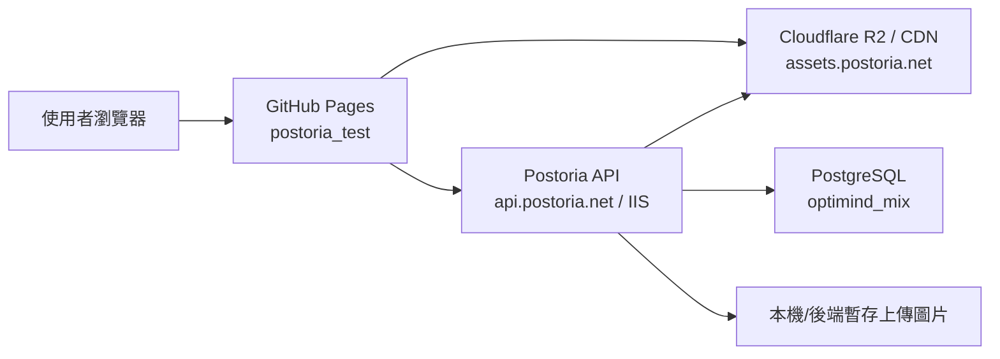
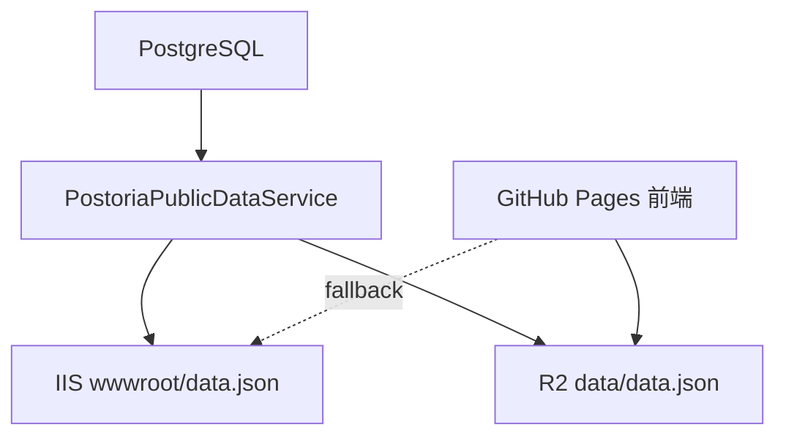

# Postoria 網站架構與規格書

更新日期：2026-05-27  
專案名稱：Postoria / 明信片收藏  
前端測試站：https://alexhung99.github.io/postoria_test/  
正式 API：https://api.postoria.net  
公開資料檔：https://assets.postoria.net/data/data.json

## 1. 系統目標

Postoria 是一個明信片收藏與分享網站。網站主要提供：

- 瀏覽各國與各城市/地區的明信片。
- 查看熱門收藏 TOP 50。
- 搜尋明信片標題、編號、國家、城市與 hashtag。
- 會員註冊、登入、Google 登入。
- 會員收藏明信片。
- 會員上傳明信片，資料先進入待審核區，審核通過後才公開。

目前公開瀏覽資料改為讀取單一 `data.json`，降低 API 主機流量與資料庫查詢壓力。

## 2. 目前整體架構



## 3. 網域與服務分工

| 項目 | 目前位置 | 用途 |
|---|---|---|
| 前端網站 | `https://alexhung99.github.io/postoria_test/` | 靜態 HTML/CSS/JS |
| 公開資料 JSON | `https://assets.postoria.net/data/data.json` | 首頁、國家、城市、明信片清單、搜尋、熱門收藏 |
| 公開圖片 | `https://assets.postoria.net/...` | 明信片圖片、banner、logo 等靜態資源 |
| 後端 API | `https://api.postoria.net` | 會員、收藏、上傳、登入、資料產生 |
| Swagger | `https://api.postoria.net/swagger` | API 文件，受控開放 |
| PostgreSQL | `optimind_mix` | Postoria 會員、明信片、收藏、上傳待審核資料 |

## 4. 前端架構

前端 repo：`C:\GitRepos\pikimin_gen\postoria_test`

主要檔案：

| 檔案 | 說明 |
|---|---|
| `index.html` | 網站 HTML 入口、導覽列、基本 DOM 容器 |
| `styles.css` | RWD、首頁、明信片清單、彈窗、會員頁樣式 |
| `app.js` | 前端主邏輯、資料讀取、路由、搜尋、收藏、上傳 |
| `assets/` | 前端靜態圖片與 logo |

### 4.1 前端資料讀取策略

正式環境：

1. 優先讀取 `https://assets.postoria.net/data/data.json`
2. 如果 R2 讀取失敗，自動 fallback 到 `https://api.postoria.net/data.json`

本機環境：

1. 讀取 `http://localhost:5073/data.json`

目前前端公開瀏覽不再呼叫下列 API：

- `/api/postoria/home`
- `/api/postoria/countries`
- `/api/postoria/cities`
- `/api/postoria/postcards`

這些功能都改由 `data.json` 在瀏覽器本地篩選、排序與分頁。

### 4.2 前端仍會呼叫 API 的功能

| 功能 | API |
|---|---|
| 會員註冊 | `POST /api/members/register` |
| 會員登入 | `POST /api/members/login` |
| Google 登入 | `GET /api/external-auth/google/login` |
| 讀會員收藏 ID | `GET /api/members/me/favorites` |
| 讀會員收藏明信片 | `GET /api/members/me/favorites/postcards` |
| 加入/取消收藏 | `PUT/DELETE /api/members/me/favorites/{postcardId}` |
| 上傳明信片 | `POST /api/members/me/postcard-uploads` |

## 5. `data.json` 規格

公開資料檔 URL：

```text
https://assets.postoria.net/data/data.json
```

備援 URL：

```text
https://api.postoria.net/data.json
```

### 5.1 JSON 結構

```json
{
  "updatedAt": "2026-05-27T01:14:40.990544+00:00",
  "banners": [],
  "countries": [],
  "citiesByCountry": {},
  "postcards": [],
  "popular": []
}
```

### 5.2 欄位說明

| 欄位 | 型別 | 說明 |
|---|---|---|
| `updatedAt` | string | `data.json` 產生時間，UTC ISO 格式 |
| `banners` | array | 首頁 banner 輪播圖片 |
| `countries` | array | 全部國家/地區清單與統計 |
| `citiesByCountry` | object | 依國家分組的城市/地區清單 |
| `postcards` | array | 全部已公開、未刪除的明信片 |
| `popular` | array | 熱門收藏前 50 名 |

### 5.3 Banner 物件

```json
{
  "imageUrl": "https://assets.postoria.net/images/banner-01.jpg",
  "title": "Postoria banner 01"
}
```

### 5.4 Country 物件

```json
{
  "name": "日本",
  "englishName": "JAPAN",
  "count": 1250,
  "imageUrl": "https://assets.postoria.net/images/japan/..."
}
```

### 5.5 City 物件

```json
{
  "name": "東京",
  "count": 123,
  "imageUrl": "https://assets.postoria.net/tokyo/images/pc_010.jpg"
}
```

### 5.6 Postcard 物件

```json
{
  "id": "uuid",
  "legacyId": "pc_xxx",
  "legacyNumber": 1204,
  "title": "Wat Rong Khun - White Temple",
  "country": "泰國",
  "city": "清萊",
  "latitude": 19.8242,
  "longitude": 99.7638,
  "imageUrl": "https://assets.postoria.net/images/thailand/...",
  "tags": ["泰國", "清萊"],
  "postcardType": "花",
  "likeCount": 12,
  "viewCount": 0,
  "createdAt": "2026-05-27T00:00:00"
}
```

## 6. 快取策略

`data.json` 目前回應 header：

```text
Cache-Control: public, max-age=60, s-maxage=300
Access-Control-Allow-Origin: *
```

說明：

- 瀏覽器最多快取 60 秒。
- CDN/Cloudflare 可快取 300 秒。
- R2 bucket 已設定 CORS，允許 GitHub Pages 讀取。
- 前端有 API fallback，避免 R2/CORS 臨時異常造成首頁空白。

## 7. 後端架構

後端 repo：`C:\GitRepos\pikimin_gen\Postoria\Postoria`

執行環境：

- ASP.NET Core / .NET 10
- IIS：`PostoriaApiPool`
- PostgreSQL：`optimind_mix`
- ORM：Entity Framework Core + Npgsql
- Swagger：Swashbuckle

主要檔案：

| 檔案 | 說明 |
|---|---|
| `Program.cs` | ASP.NET Core 啟動、CORS、Swagger、靜態檔、`/data.json` fallback endpoint |
| `Data/PostoriaDbContext.cs` | EF Core table mapping |
| `Database/PostoriaSchemaInitializer.cs` | Postoria table/index 初始化 |
| `Services/PostoriaPublicDataService.cs` | 產生 `data.json`、寫入本機、上傳 R2 |
| `Controllers/PostoriaController.cs` | 公開資料 API、legacy import |
| `Controllers/MembersController.cs` | 會員註冊、登入、密碼功能 |
| `Controllers/MemberFavoritesController.cs` | 會員收藏 |
| `Controllers/MemberPostcardUploadsController.cs` | 會員上傳明信片 |
| `Controllers/ExternalAuthController.cs` | Google/Facebook/Microsoft 外部登入 |

## 8. `data.json` 產生與更新流程



目前會重新產生 `data.json` 的時機：

- API 啟動時。
- `/data.json` 被要求但本機檔案不存在時。
- `legacy/import` 匯入舊版明信片後。

未來需補上的時機：

- 後台審核會員上傳明信片通過後。
- 後台修改明信片資料後。
- 後台刪除或下架明信片後。

## 9. R2 設定

目前使用：

| 項目 | 值 |
|---|---|
| Bucket | `postoria-img` |
| 公開網域 | `https://assets.postoria.net` |
| data.json key | `data/data.json` |
| 公開 URL | `https://assets.postoria.net/data/data.json` |

注意：

- 金鑰不應寫入規格書。
- 正式環境應改用環境變數或 IIS 安全設定保存 R2 Access Key / Secret。
- R2 bucket 需啟用 CORS，允許 `GET`、`HEAD`。

## 10. PostgreSQL 資料表

Postoria 相關資料表：

| 表格 | 類型 | 說明 |
|---|---|---|
| `b_postoria_member` | 基本資料表 | Postoria 前台會員 |
| `b_postoria_postcard` | 基本資料表 | 已公開/可公開明信片主資料 |
| `t_postoria_member_favorite` | 交易表 | 會員收藏明信片 |
| `t_postoria_postcard_upload` | 交易表 | 會員上傳待審核明信片 |

所有 Postoria 表皆使用 UUID 作為 PK，並包含標準欄位如：

- `company_uid`
- `created_at`
- `created_by`
- `updated_at`
- `updated_by`
- `is_deleted`

目前資料表與欄位已加 PostgreSQL 中文 COMMENT。

### 10.1 `b_postoria_member`

用途：網站前台會員登入與帳號資料。

主要欄位：

- `postoria_member_uid`
- `company_uid`
- `member_code`
- `email`
- `normalized_email`
- `password_hash`
- `display_name`
- `phone`
- `avatar_url`
- `email_verified`
- `phone_verified`
- `is_locked`
- `last_login_at`
- `password_date`
- `reset_password_token_hash`
- `reset_password_token_expires_at`

### 10.2 `b_postoria_postcard`

用途：正式公開的明信片主資料。

主要欄位：

- `postcard_uid`
- `company_uid`
- `legacy_id`
- `legacy_number`
- `title`
- `country`
- `city`
- `latitude`
- `longitude`
- `image_path`
- `tags`
- `postcard_type`
- `like_count`
- `view_count`
- `is_published`

### 10.3 `t_postoria_member_favorite`

用途：會員收藏明信片。

主要欄位：

- `member_favorite_uid`
- `company_uid`
- `postoria_member_uid`
- `postcard_uid`
- `is_deleted`
- `deleted_at`
- `deleted_by`

### 10.4 `t_postoria_postcard_upload`

用途：會員上傳明信片後，暫存待審核資料。

主要欄位：

- `postcard_upload_uid`
- `company_uid`
- `postoria_member_uid`
- `title`
- `country`
- `city`
- `latitude`
- `longitude`
- `image_path`
- `original_file_name`
- `content_type`
- `file_size`
- `postcard_type`
- `review_status`
- `reviewed_by`
- `reviewed_at`
- `review_note`
- `published_postcard_uid`

## 11. 會員登入與 Token

會員登入後，前端會存：

| localStorage key | 說明 |
|---|---|
| `postoria-member` | 會員基本資料 |
| `postoria-token` | JWT access token |
| `postoria-token-expires-at` | token 到期時間 |
| `postoria-favorites` | 會員收藏 postcard id 快取 |

前端重新載入時會檢查 token 到期時間：

- token 過期：自動登出。
- token 未過期：保留登入狀態，並讀取會員收藏資料。

## 12. 明信片上傳流程

目前已完成：

1. 會員登入後可進入「上傳明信片」。
2. 必填欄位：圖片、取得方式。
3. 可提供座標。
4. 上傳後寫入 `t_postoria_postcard_upload`。
5. 圖片暫存於後端設定的 upload path。
6. 狀態預設 `pending`。

尚未完成：

- 後台審核列表。
- 座標反查國家/城市。
- 審核通過後寫入 `b_postoria_postcard`。
- 審核通過後重新產生並上傳 `data.json`。
- 審核退件通知。

## 13. 後續建議

### 13.1 R2 金鑰安全化

目前應將 R2 設定改為環境變數或 IIS secret，不應長期放在 repo 的 `appsettings.json`。

建議使用：

```text
Postoria__R2__AccessKeyId
Postoria__R2__SecretAccessKey
```

### 13.2 後台審核功能

新增後台 API：

- `GET /api/admin/postcard-uploads?status=pending`
- `GET /api/admin/postcard-uploads/{id}`
- `POST /api/admin/postcard-uploads/{id}/approve`
- `POST /api/admin/postcard-uploads/{id}/reject`

審核通過流程：

1. 讀取 `t_postoria_postcard_upload`
2. 依座標判斷國家與城市
3. 搬移或上傳圖片至正式 R2 path
4. 建立 `b_postoria_postcard`
5. 更新 upload 狀態為 `approved`
6. 重新產生並上傳 `data/data.json`

### 13.3 data.json 分檔

目前 `data.json` 約 592KB，仍可接受。若資料量增加，可拆為：

- `data/home.json`
- `data/countries.json`
- `data/cities/{country}.json`
- `data/postcards/{country}/{city}.json`
- `data/popular.json`

但現階段單一檔案可讓首頁和搜尋最快完成，且 API 流量最低。

### 13.4 圖片最佳化

目前網站主要 loading 壓力仍可能來自圖片。建議：

- 所有清單圖片使用縮圖版本。
- R2 依用途分 `original/`、`thumb/`、`card/`。
- 前端列表只讀 `thumb/card`，明信片詳情才讀原圖。

## 14. 目前部署流程

### 14.1 前端

```powershell
cd C:\GitRepos\pikimin_gen\postoria_test
git add .
git commit -m "message"
git push origin main
```

GitHub Pages 自動更新。

### 14.2 後端

```powershell
cd C:\GitRepos\pikimin_gen\Postoria\Postoria
dotnet build
Stop-WebAppPool -Name PostoriaApiPool
dotnet publish -c Release -o C:\GitRepos\pikimin_gen\PostoriaIisPublish
Start-WebAppPool -Name PostoriaApiPool
```

### 14.3 data.json 手動確認

```text
https://api.postoria.net/data.json
https://assets.postoria.net/data/data.json
```

確認項目：

- HTTP 200
- 有 `updatedAt`
- `countries` 有資料
- `postcards` 有資料
- R2 回 `access-control-allow-origin: *`

